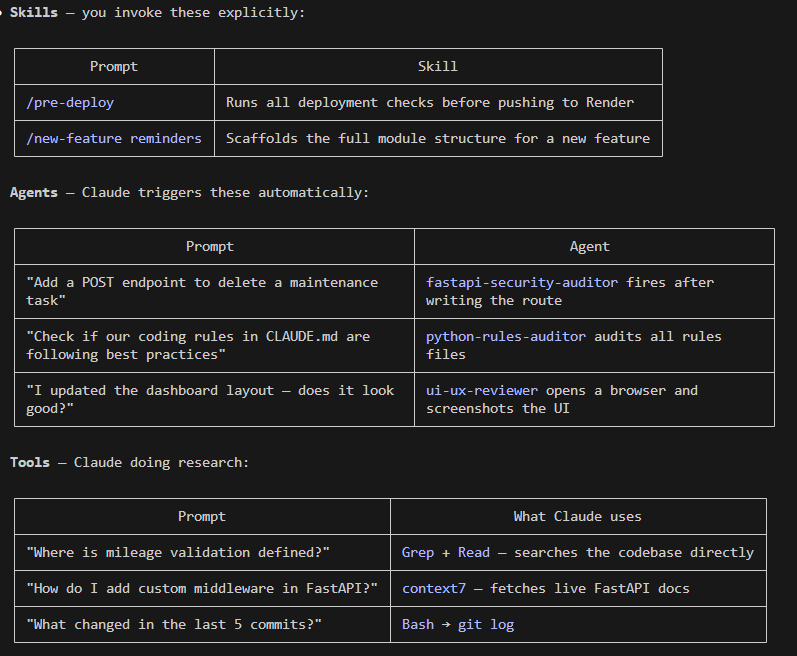
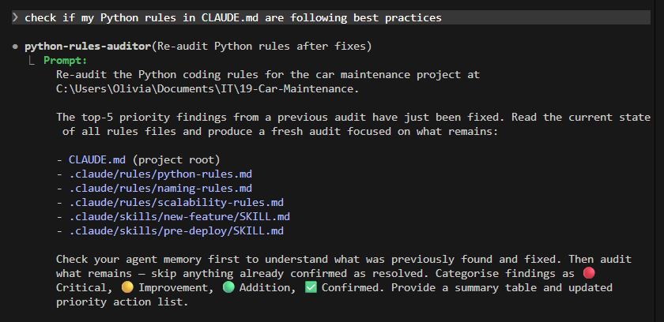

# AI Setup

## Rules — passive guardrails applied to every interaction
- `python-rules.md` — coding style, type hints, error handling, async patterns
- `naming-rules.md` — variable, function, file, and URL naming conventions
- `scalability-rules.md` — module structure, extension patterns, config-driven design
- `CLAUDE.md` — top-level project rules (logging, validation pipeline, security, git workflow)

## Skills — workflows you invoke on demand
- `/pre-deploy` — 12-point checklist before every Render deployment
- `/new-feature` — scaffolds a full feature module (branch, files, router registration)

## Agents — specialist Claude instances triggered automatically by context
- `fastapi-security-auditor` — reviews new routes and Airtable code for security issues
- `python-rules-auditor` — audits your rules files against Python best practices
- `ui-ux-reviewer` — screenshots the live UI and gives design feedback

## MCP Servers — external tools Claude can call
- `context7` — fetches live library documentation (FastAPI, Pydantic, etc.)
- `Playwright` — controls a real browser for UI testing and screenshots
- `Google Drive` — reads and writes files in your Drive

## Memory — persistent knowledge across conversations
- Project memory (goals, decisions, Airtable setup)
- User memory (your preferences, background, how you like to work)
- Agent memory (each agent remembers findings across sessions)

