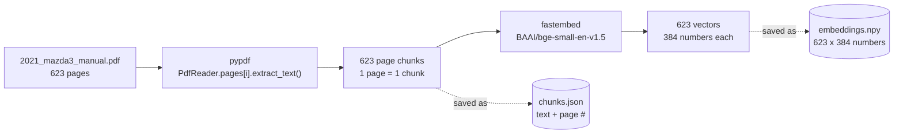
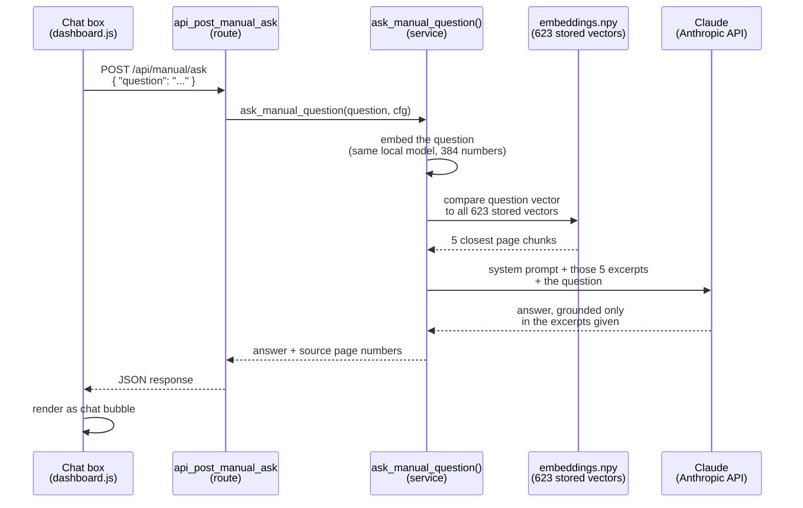

# How `manual_qa` Works: RAG on One PDF

Claude never reads your whole 623-page owner's manual. Every time you ask a question, your
app hands it 5 short excerpts instead — chosen by comparing lists of numbers, not by
understanding English. This doc walks through the actual mechanism in two phases, using real
data from your own build.

## The problem this solves

A language model can only read what you put in front of it in a single request, and a
623-page manual is too much text to paste in every time someone asks a question. So instead
of sending the whole book, the app does two separate jobs at two separate times:

- **Indexing** — done once, offline, by `scripts/build_manual_index.py`
- **Answering** — done fresh, every time someone asks, by
  `backend/modules/manual_qa/manual_qa_service.py`

## The core trick: turning a sentence into numbers

A local model called `fastembed` (running on your own machine, no API call) reads a chunk of
text and outputs 384 numbers that describe its *meaning*. Two chunks about similar topics end
up with similar numbers. That's the entire basis for "search" here — no keyword matching,
just comparing number lists.

This is a real page from your manual and the real first 8 of its 384 numbers:

**Manual, page 461:**
> "Changing the engine oil should be performed by an Authorized Mazda Dealer."

**Embedded into (first 8 of 384 numbers):**
```
-0.0048, -0.0179, -0.0334, 0.0067, 0.0203, 0.0270, 0.0493, 0.0557, ...
```
Stored in `data/manual_index/embeddings.npy`.

---

## Phase 01 — Build the index

Runs once, offline: `python scripts/build_manual_index.py`

This step reads the PDF once and converts every page into that number-list form, so nothing
has to be re-read at question time.



**What changes here:** raw PDF text becomes two small files on disk — the actual sentences
(`chunks.json`) and their number-list fingerprints (`embeddings.npy`). Nothing about this step
runs while a user is waiting.

---

## Phase 02 — Answer a question

Runs on every request: `backend/modules/manual_qa/manual_qa_service.py`

This is what happens between clicking "Ask" and the answer appearing in the chat box — five
hops, roughly four seconds.



**The one hop that matters:** Claude only ever sees the 5 excerpts chosen by the vector
comparison — never the full manual, and never the question alone. Remove that comparison step
and Claude would be guessing from general car knowledge instead of your specific 2021 Mazda 3.

---

## Why this counts as "RAG"

- **R**etrieval — the vector comparison that pulls 5 relevant pages out of 623.
- **Augmented** — those pages get added into the prompt alongside the question.
- **Generation** — Claude writes the actual answer, but only from what it was handed.

Swap the manual PDF for a different document and re-run `build_manual_index.py` — the rest of
the pipeline doesn't change, because it never knew it was a car manual in the first place. It
only ever compares number lists.
